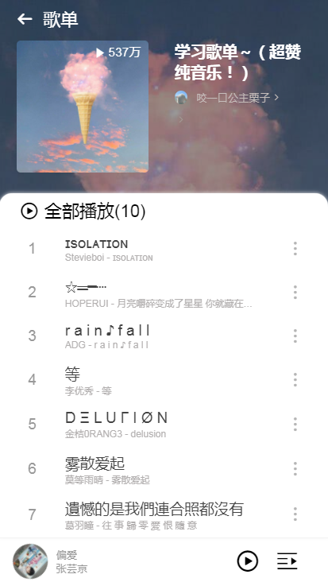

# wymusic

## Project setup


### //服务端(app.js文件修改自己的ip地址及端口)
* 服务端代码来源 [网易云音乐API](https://binaryify.github.io/NeteaseCloudMusicApi/#/)
```
cd server
npm install   
node app.js
```

### //web页面(//vue.config.js 文件 配置跨域地址(服务端ip地址及端口))
```
cd myMusic
npm install  
npm run serve
```

#### 页面图片





### Customize configuration
See [Configuration Reference](https://cli.vuejs.org/config/).
